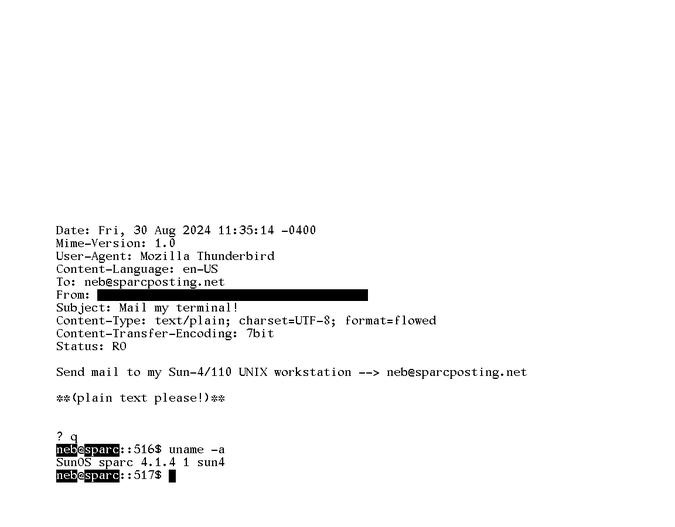

# SPARCposting Blog Content

## Send an email to my Sun-4! 
9/15/2024

Send me an email, and it'll get forwarded straight to my Sun-4 workstation!

--> neb@sparcposting (dot) net

Please encode your message in *plaintext* - Gmail's plaintext mode still sends in base64 anyway for some reason.

I'll write up an explainer on how this works later!

## Greetings (?) 
9/15/2024

I've created this blog as a web presence to complement my Mastodon/Bluesky, as well as to replace the void Cohost is soon to be leaving on the Web. :(

I plan on detailing my SPARC tinkering notes here as well as my off-topic thoughts. More to come
